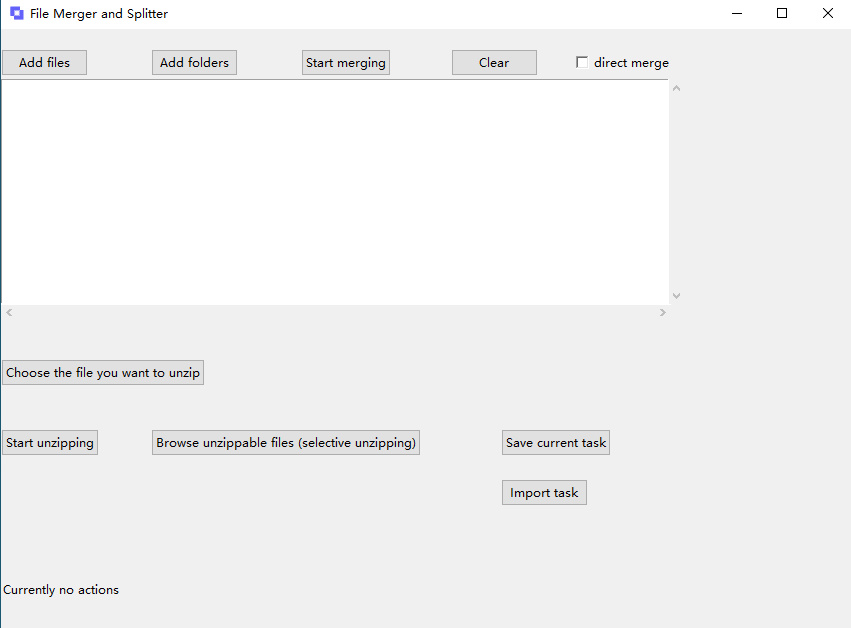
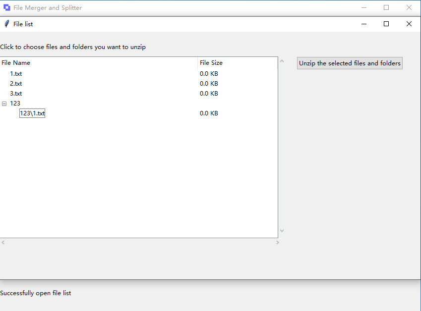

# separable_merge

## Introduction

This is a file merger and splitter which uses an algorithm designed by me to merge multiple files and split files. This file merging algorithm, which I call it `separable merge`, could merge multiple files into a single binary file, which could be split into the original files later. The splitting information is stored as the header of the merged file. This algorithm could store not only files, but also folders into a single binary file. The folders could be nested, and all of the file locations with folders will be stored in the splitting information. The type of file that this algorithm generates could be a merged file standard on its own, I think we can call it `fm`, which stands for `file merge`.

## Cross-platform

This file merging and splitting algorithm supports all file types, and is cross-platform since its design is based on basic python data structures, it will work fine on all of Windows, Linux and macOS. 

Currently I already implement a file merger and splitter executable which works on Windows, and an executable for Linux and an app for macOS, all of them could be opened by double-click. The executable for Windows and the compatible executables for Linux and macOS could be downloaded at the release page.

## File extension

The default file extension of merged file generated by this algorithm is `.fm`, and there is a `file merge task` file which stores current merged task, which has the default file extension `.fmt`.

## Usage

With the file merger and splitter, you can merge any files and folders into a single binary file, and open the merged file to browse the files inside it, with all of the files and folders accessible, you can choose to split selected files and folders in that merged file.

There is also a file splitter in this repository, which is simply a program that could cut a file into several parts, you can choose to cut in a number of parts evenly or cut in a fixed file size.

On Windows, you can firstly generate a `.fm` file by merging some of the files, and then right click on the merged file to choose `Open with` and then browse and select `file merger.exe` and then choose to always open this type of file using it. Then you can double click on the `.fm` file to open with the file merger and splitter executable, which will show you the separable file list inside the merged file. This is similar for `.fmt` file, which could be imported in the executable when you double click on it after the same steps.

On macOS, the steps are similar to Windows, you can choose to open `.fm` files and `.fmt` files with the file merger app as default.

On Linux, you need to create an application entry in the applications folder in your user directory, for the detailed steps, you can refer to [here](https://unix.stackexchange.com/questions/504804/how-does-open-with-a-custom-executable-in-Linux-work) and [here](https://superuser.com/questions/1282203/how-do-i-add-a-shortcut-to-the-show-applications-menu-in-ubuntu-17), and then you can right click on the merged files to choose the file merger application in the open with other applications window.

## Previews

Here are the shortcuts of the file merger and splitter.

                                                main window

                                        browse file list in a fm file
